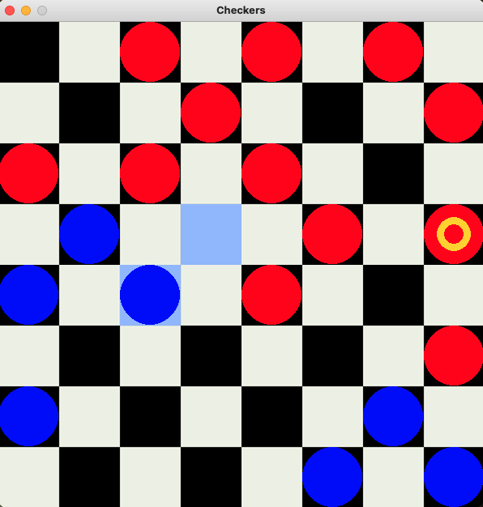
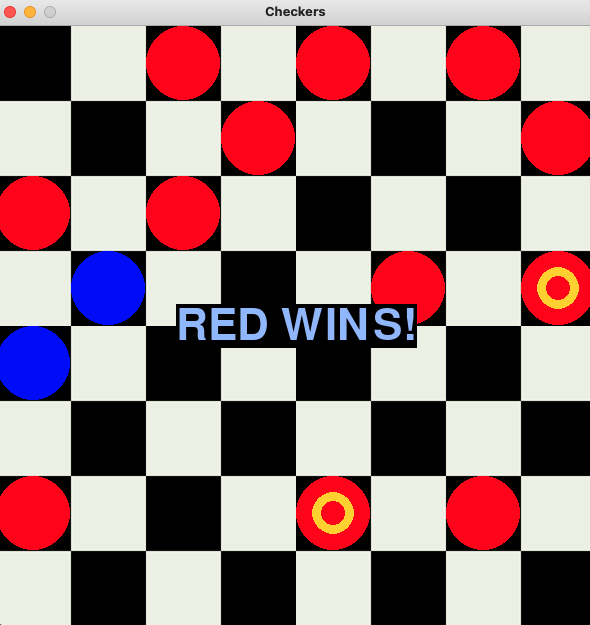

# Checkers Engine

This is an open-source Checkers engine built using the Min-Max algorithm for decision making. The project was developed as part of an algorithm and data structures course in my first year of studies.

---

## Table of Contents
- [Introduction](#introduction)
- [Features](#features)
- [Technologies Used](#technologies-used)
- [Installation](#installation)
- [Usage](#usage)
- [Preview](#preview)
- [License](#license)

---

## Introduction

The Checkers Engine is designed to simulate the classic game of Checkers. It uses the Min-Max algorithm with a tree structure to evaluate the best possible moves for the AI. The behavior of the AI is driven by a customizable heuristic function that assesses the board state, allowing users to fine-tune the AI's decision-making.

This project also includes a GUI, enabling users to interact with the game visually.

---

## Features

- **Min-Max Algorithm**: The AI employs a Min-Max tree structure to evaluate moves and determine the best decision.
- **Heuristic Board Evaluation**: A customizable heuristic to evaluate the current state of the game board.
- **Graphical User Interface (GUI)**: An easy-to-use interface to play the game, display the board, and handle moves.

---

## Technologies Used

- **Programming Language**: Python
- **GUI Framework**: Pygame
- **Algorithm**: Min-Max algorithm

---

## Installation

### Using Conda (Recommended)

If you are using Conda to manage your environment, follow these steps:


1. Clone the repository:
   ```bash
   git clone https://github.com/IgorAmi52/Checkers-Engine.git
2. Navigate to the project directory:
   ```bash
   cd checkers-engine
3. Install the necessary dependencies:
   ```bash
   conda env create -f environment.yml
---

## Usage

- **Run the Project**: To start the Checkers Engine, run the following command in your terminal:
   ```bash
   python checkers_engine.py
- **Try to beat it :)**: Once the script is running, a GUI will open displaying the Checkers board. You can interact with the game by clicking on the board to make moves.

- **Customizing the AI**: To adjust the AI's behavior, modify the heuristic function in the code. The heuristic is responsible for evaluating the board state and guiding the AI's decision-making process. You can experiment with different strategies by changing this function.

--- 

## Preview

### Gameplay
Gameplay preview:



### Me loosing
Game ending:



---

## License

This project is licensed under the MIT License.
